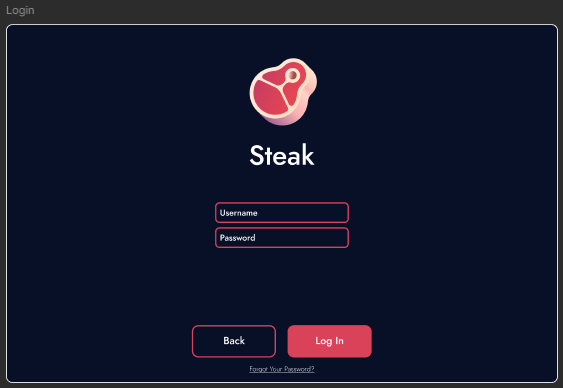
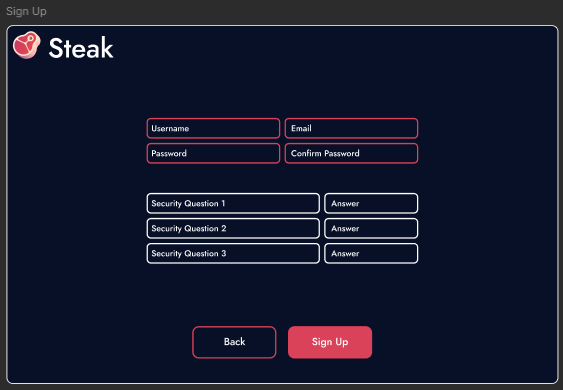
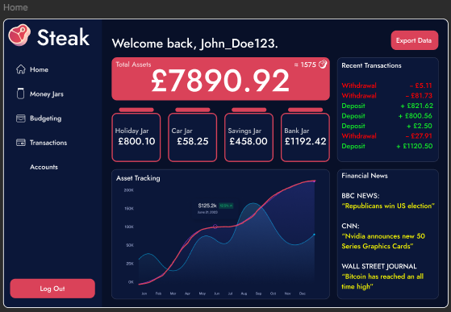
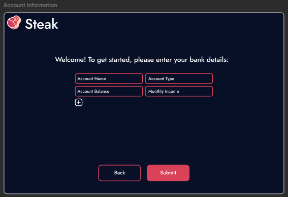

# Sprint 2 Review: January 22, 2025 - January 28, 2025

**Sprint Goal:** Complete the login and registration pages, design the landing page, create the account information form, and modernize the design.

## Sprint Accomplishments

1. **Login and Registration Pages:**
   - **Completed By:** Harrison & Jack
   - **Outcome:** Successfully completed the design and implementation of the login and registration pages. This included finalizing design elements and ensuring that the functionality for user authentication was robust and user-friendly.

2. **Landing Page Design:**
   - **Completed By:** Gareth & Lewis
   - **Outcome:** Designed a visually appealing and informative landing page. The page effectively highlights the application's features and benefits, creating a compelling entry point for users.

3. **Account Information Form:**
   - **Completed By:** Harrison & Gareth
   - **Outcome:** Designed and implemented a comprehensive account information form that allows users to input and manage their account details efficiently.

4. **Modernization of Design:**
   - **Completed By:** Gareth
   - **Outcome:** Successfully modernized the overall design of the application to enhance visual appeal and user experience. This included updating colour schemes, typography, and layout structures to align with current design trends and improve usability.

## Outstanding Tasks

- **None:** All tasks assigned for Sprint 2 were completed successfully.

## Team Reflections

- **Progress Summary:** The team achieved all the objectives set for Sprint 2. The successful completion of the login and registration pages, along with the landing page, account information form, and design modernization, has brought us closer to a functional prototype.
- **Challenges:** The team faced minimal challenges during this sprint, thanks in part to effective planning and regular design review meetings that facilitated timely feedback and course corrections.
- **Tools Utilized:** We continued to use Figma for design, React and CSS for front-end development, Python for back-end development and Git for version control. The integration of these tools helped streamline the development process and maintain consistent communication across the team.

Overall, Sprint 2 was highly productive, with all planned tasks completed on schedule. The team is now well-prepared to tackle the objectives for Sprint 3, building on the solid groundwork laid in the first two sprints.

## Final Designs

- **Login Design:**

- **Registration Design:**

- **Landing Page Design:**

- **Account Information Design:**

