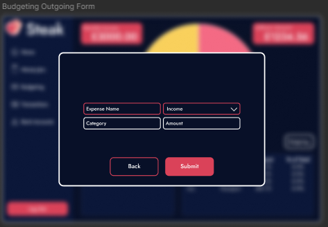
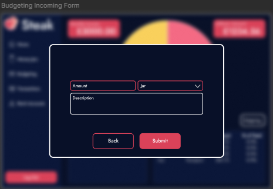
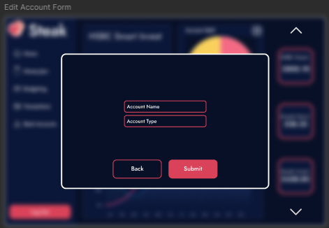
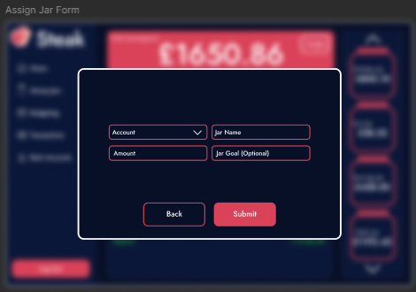
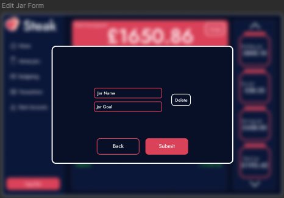
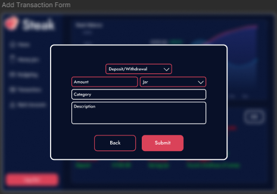
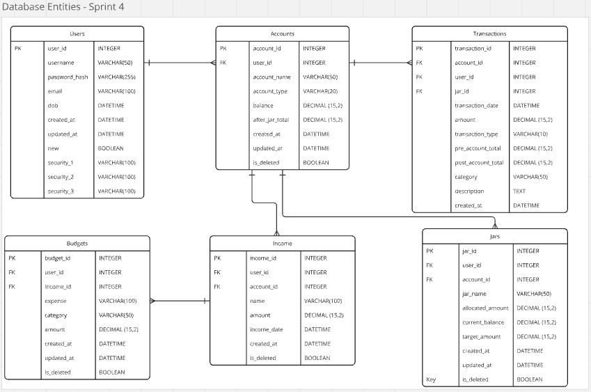

# Sprint 4 Review: February 5, 2025 - February 11, 2025

**Sprint Goal:** Complete rollover form designs, develop system diagrams, and enhance the dashboard with backend integration and database updates.

## Sprint Accomplishments

1. **Rollover Form Designs:**
   - **Budget Form Design:** Successfully completed the design for creating and managing budgets.
   - **Manage Accounts Form Design:** Finalized the design for adding and managing accounts.
   - **Jar Form Design:** Finished the design for creating and managing Jars.
   - **Transactions Form Design:** Completed the design for managing transactions.
   - **Income Form Design:** Designed the form for entering and managing income details.

2. **System Diagrams:**
   - Developed comprehensive system diagrams including class, data flow, sequence, and activity diagrams. 
   - [View System Modeling Documentation](/Docs/System%20Modelling)

3. **Coding Tasks:**
   - **Dashboard Template Generation:** Successfully integrated the Python backend with the dashboard template and developed a simple JSX interface.
   - **Database Changes:** Implemented necessary database changes and ensured they were reflected in the design.
   - **Unit Test 2:** Conducted unit tests for the account form, updating new status, and dashboard display.
   - [View Unit Test 2 Documentation](/Docs/Unit%20Tests/Test_2_Account_info.md)

## Team Reflections

- **Progress Summary:** Despite Jack's unavailability for the first 4 days, the team managed to complete all planned tasks successfully. The rollover form designs and system diagrams were completed on schedule, and significant progress was made in dashboard integration.
- **Challenges:** Jack's absence required some task reallocation and timeline adjustments, but the team adapted effectively.
- **Tools Utilized:** Continued use of Figma for design, React and CSS for front-end development, Python and Pytest for backend development and testing, Mermaid for diagramming, and Git for version control.

Overall, Sprint 4 was a successful sprint with all objectives achieved. The team is well-positioned to continue building on this progress in the upcoming sprints.

## Final Designs and Diagrams

- **Budget Form Design:**

- **Income Form Design:**

- **Manage Accounts Form Design:**

- **Jar Form Design:**

- **Edit Jar Form Design:**

- **Transactions Form Design:**

- **Income Form Design:**

- **Database ERD:**

