# Activity Diagrams

## User Registration Process

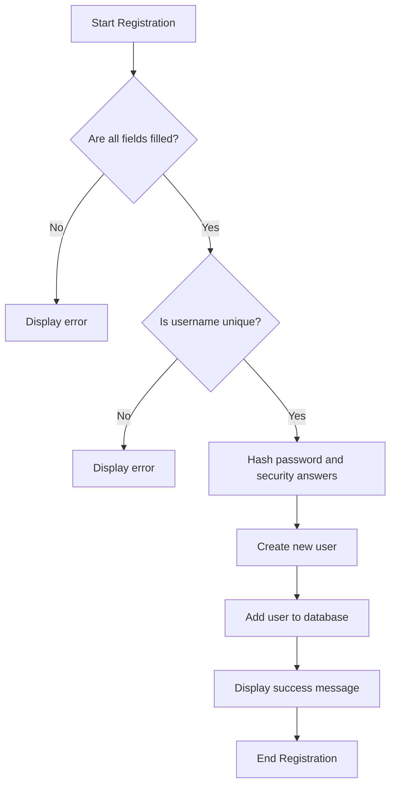
```mermaid
flowchart TD
    A[Start Registration] --> B{Are all fields filled?}
    B -- No --> C[Display error]
    B -- Yes --> D{Is username unique?}
    D -- No --> E[Display error]
    D -- Yes --> F[Hash password and security answers]
    F --> G[Create new user]
    G --> H[Add user to database]
    H --> I[Display success message]
    I --> J[End Registration]
```

## User Login Process

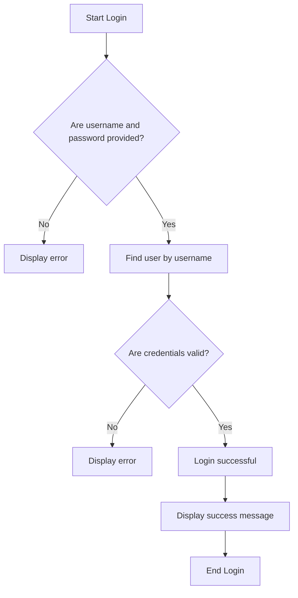
```mermaid
flowchart TD
    A[Start Login] --> B{Are username and password provided?}
    B -- No --> C[Display error]
    B -- Yes --> D[Find user by username]
    D --> E{Are credentials valid?}
    E -- No --> F[Display error]
    E -- Yes --> G[Login successful]
    G --> H[Display success message]
    H --> I[End Login]
```

## Forgot Password Process

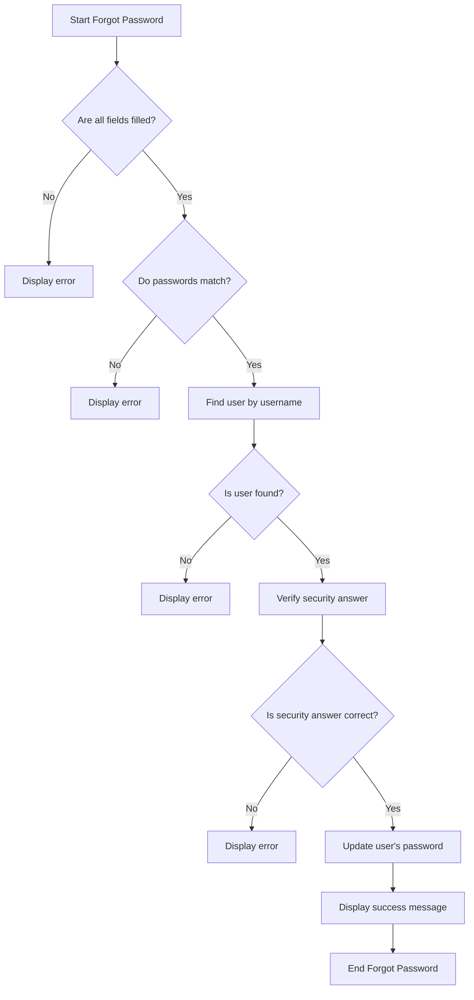
```mermaid
flowchart TD
    A[Start Forgot Password] --> B{Are all fields filled?}
    B -- No --> C[Display error]
    B -- Yes --> D{Do passwords match?}
    D -- No --> E[Display error]
    D -- Yes --> F[Find user by username]
    F --> G{Is user found?}
    G -- No --> H[Display error]
    G -- Yes --> I[Verify security answer]
    I --> J{Is security answer correct?}
    J -- No --> K[Display error]
    J -- Yes --> L[Update user's password]
    L --> M[Display success message]
    M --> N[End Forgot Password]
```

## Account Information Form Process

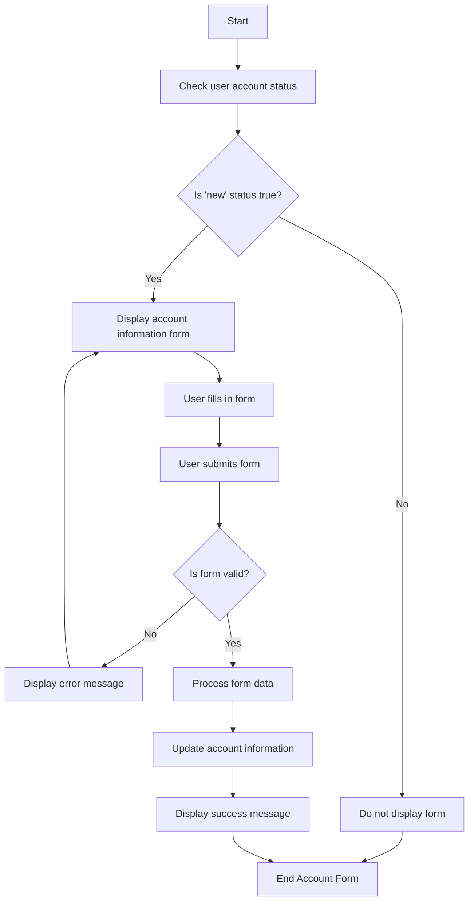
```mermaid
flowchart TD
    A[Start] --> B[Check user account status]
    B --> C{Is 'new' status true?}
    C -- No --> D[Do not display form]
    C -- Yes --> E[Display account information form]
    E --> F[User fills in form]
    F --> G[User submits form]
    G --> H{Is form valid?}
    H -- No --> I[Display error message]
    I --> E
    H -- Yes --> J[Process form data]
    J --> K[Update account information]
    K --> L[Display success message]
    D --> M[End Account Form]
    L --> M[End Account Form]
```

## Total Balance Process

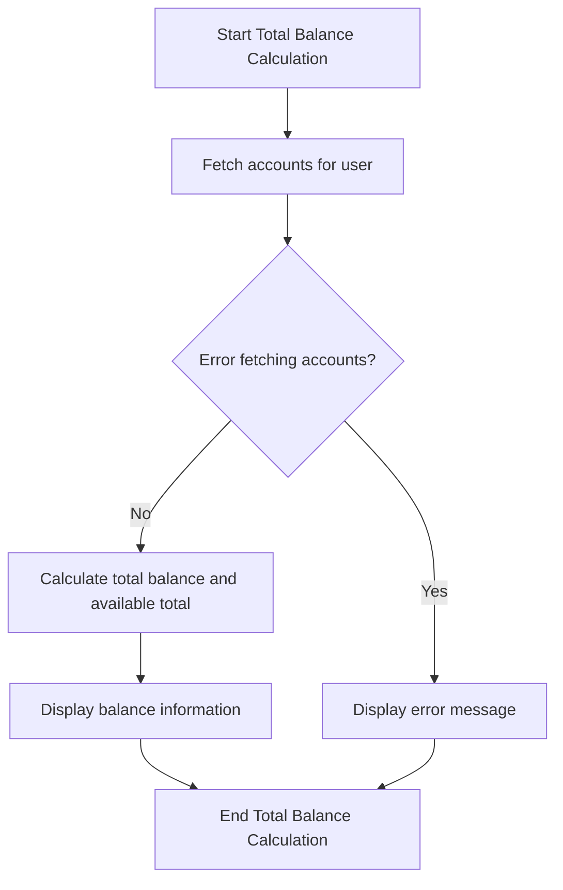
```mermaid
flowchart TD
    A[Start Total Balance Calculation] --> B[Fetch accounts for user]
    B --> C{Error fetching accounts?}
    C -- Yes --> D[Display error message]
    C -- No --> E[Calculate total balance and available total]
    E --> F[Display balance information]
    F --> G[End Total Balance Calculation]
    D --> G
```

## Create Jar Process

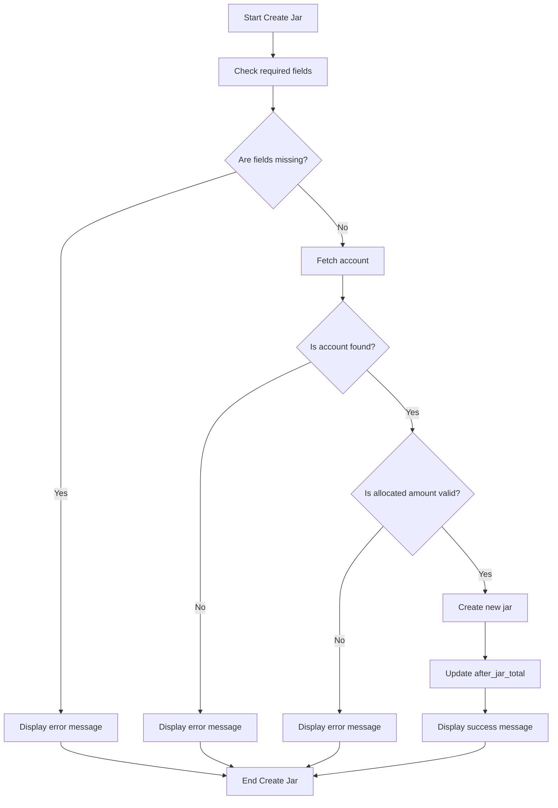
```mermaid
flowchart TD
    A[Start Create Jar] --> B[Check required fields]
    B --> C{Are fields missing?}
    C -- Yes --> D[Display error message]
    C -- No --> E[Fetch account]
    E --> F{Is account found?}
    F -- No --> G[Display error message]
    F -- Yes --> H{Is allocated amount valid?}
    H -- No --> I[Display error message]
    H -- Yes --> J[Create new jar]
    J --> K[Update after_jar_total]
    K --> L[Display success message]
    L --> M[End Create Jar]
    D --> M
    G --> M
    I --> M
```

## Get User Jars Process

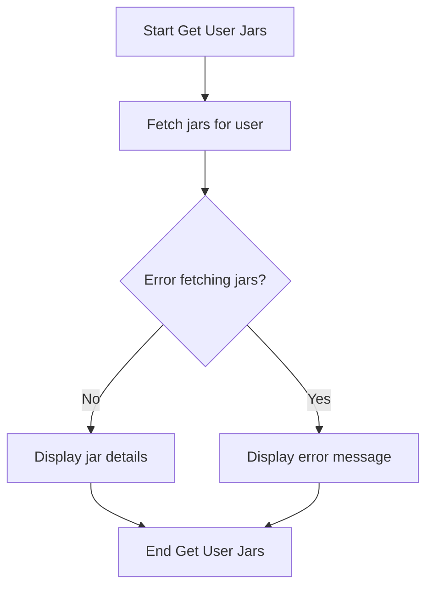
```mermaid
flowchart TD
    A[Start Get User Jars] --> B[Fetch jars for user]
    B --> C{Error fetching jars?}
    C -- Yes --> D[Display error message]
    C -- No --> E[Display jar details]
    E --> F[End Get User Jars]
    D --> F
```

## Update Jar Process

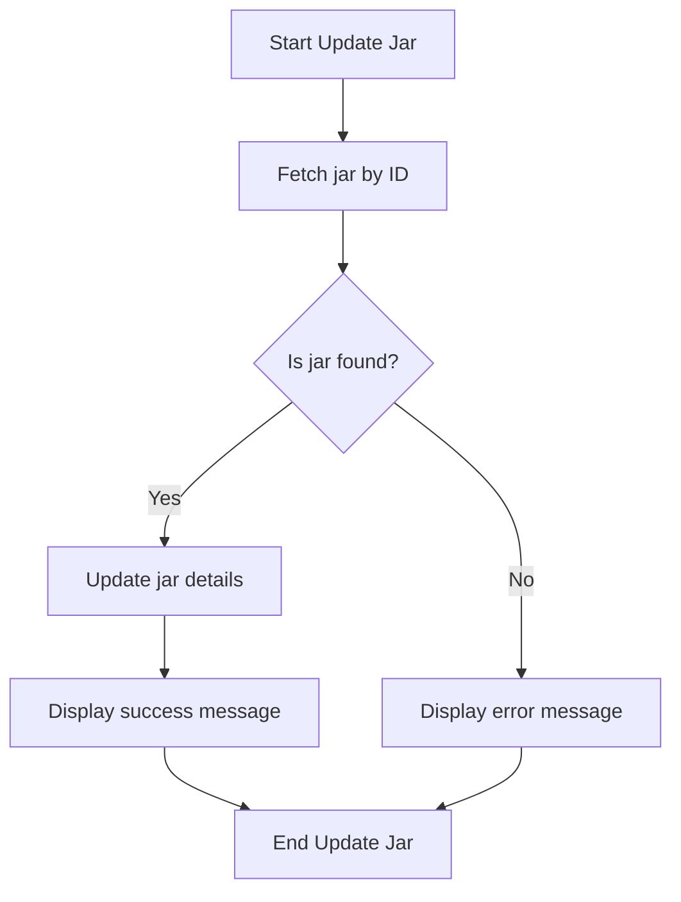
```mermaid
flowchart TD
    A[Start Update Jar] --> B[Fetch jar by ID]
    B --> C{Is jar found?}
    C -- No --> D[Display error message]
    C -- Yes --> E[Update jar details]
    E --> F[Display success message]
    F --> G[End Update Jar]
    D --> G
```

## Delete Jar Process

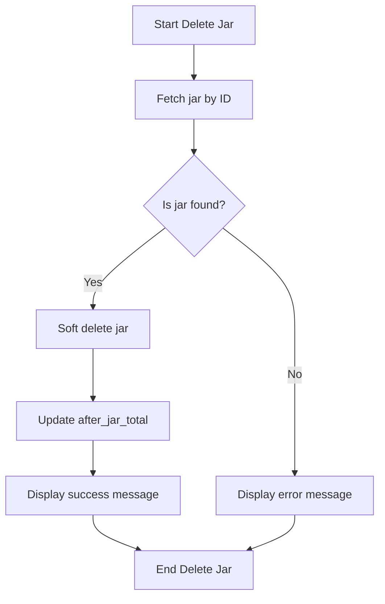
```mermaid
flowchart TD
    A[Start Delete Jar] --> B[Fetch jar by ID]
    B --> C{Is jar found?}
    C -- No --> D[Display error message]
    C -- Yes --> E[Soft delete jar]
    E --> F[Update after_jar_total]
    F --> G[Display success message]
    G --> H[End Delete Jar]
    D --> H
```

## Create Transaction Process

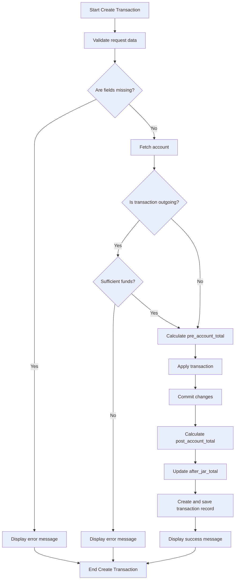
```mermaid
flowchart TD
    A[Start Create Transaction] --> B[Validate request data]
    B --> C{Are fields missing?}
    C -- Yes --> D[Display error message]
    C -- No --> E[Fetch account]
    E --> F{Is transaction outgoing?}
    F -- Yes --> G{Sufficient funds?}
    G -- No --> H[Display error message]
    G -- Yes --> I[Calculate pre_account_total]
    F -- No --> I
    I --> J[Apply transaction]
    J --> K[Commit changes]
    K --> L[Calculate post_account_total]
    L --> M[Update after_jar_total]
    M --> N[Create and save transaction record]
    N --> O[Display success message]
    O --> P[End Create Transaction]
    D --> P
    H --> P
```

## Get User Transactions Process

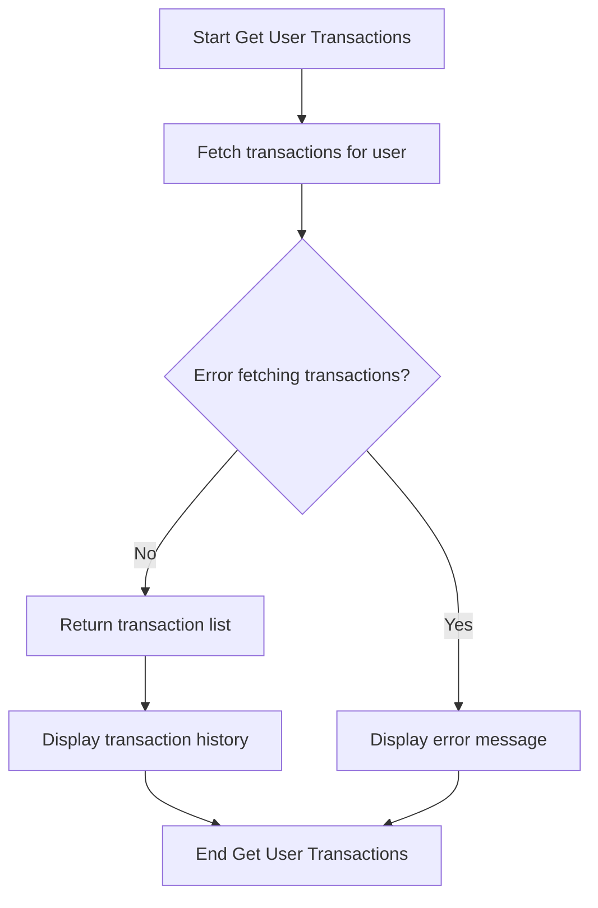
```mermaid
flowchart TD
    A[Start Get User Transactions] --> B[Fetch transactions for user]
    B --> C{Error fetching transactions?}
    C -- Yes --> D[Display error message]
    C -- No --> E[Return transaction list]
    E --> F[Display transaction history]
    F --> G[End Get User Transactions]
    D --> G
```

## Get User Jar Transactions Process

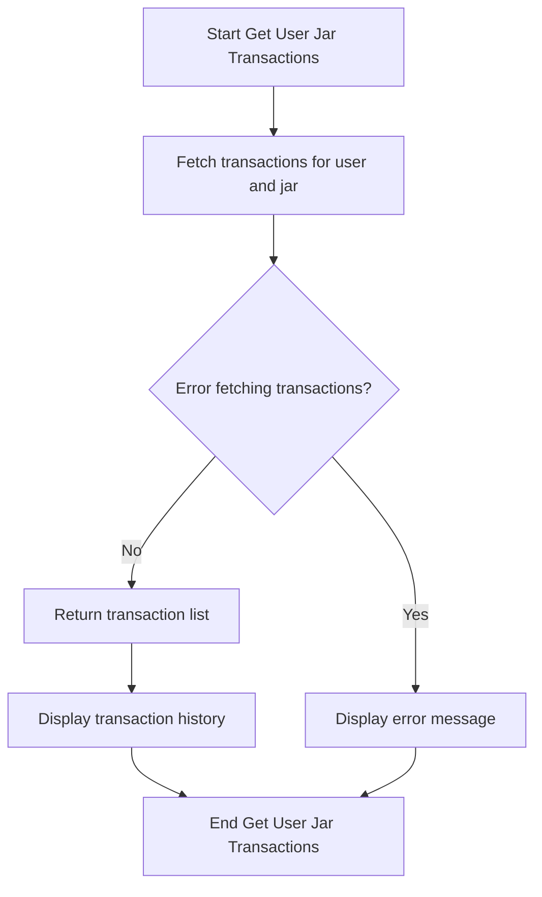
```mermaid
flowchart TD
    A[Start Get User Jar Transactions] --> B[Fetch transactions for user and jar]
    B --> C{Error fetching transactions?}
    C -- Yes --> D[Display error message]
    C -- No --> E[Return transaction list]
    E --> F[Display transaction history]
    F --> G[End Get User Jar Transactions]
    D --> G
```
## Create Account Process

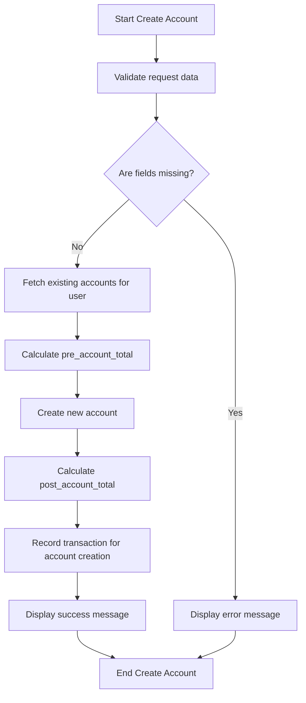
```mermaid
flowchart TD
    A[Start Create Account] --> B[Validate request data]
    B --> C{Are fields missing?}
    C -- Yes --> D[Display error message]
    C -- No --> E[Fetch existing accounts for user]
    E --> F[Calculate pre_account_total]
    F --> G[Create new account]
    G --> H[Calculate post_account_total]
    H --> I[Record transaction for account creation]
    I --> J[Display success message]
    J --> K[End Create Account]
    D --> K
```

## Update Account Process

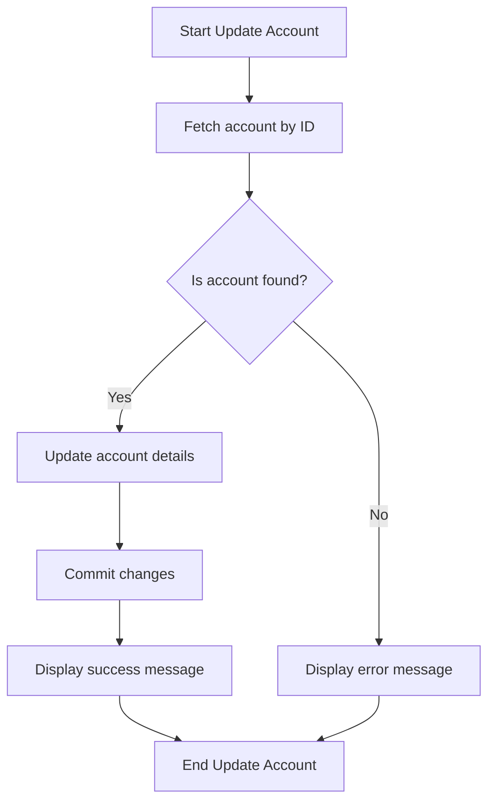
```mermaid
flowchart TD
    A[Start Update Account] --> B[Fetch account by ID]
    B --> C{Is account found?}
    C -- No --> D[Display error message]
    C -- Yes --> E[Update account details]
    E --> F[Commit changes]
    F --> G[Display success message]
    G --> H[End Update Account]
    D --> H
```

## Delete Account Process

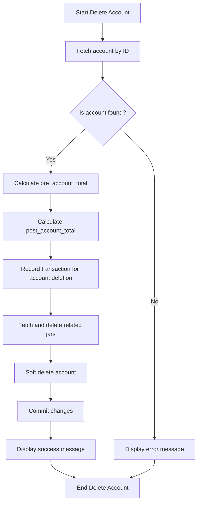
```mermaid
flowchart TD
    A[Start Delete Account] --> B[Fetch account by ID]
    B --> C{Is account found?}
    C -- No --> D[Display error message]
    C -- Yes --> E[Calculate pre_account_total]
    E --> F[Calculate post_account_total]
    F --> G[Record transaction for account deletion]
    G --> H[Fetch and delete related jars]
    H --> I[Soft delete account]
    I --> J[Commit changes]
    J --> K[Display success message]
    K --> L[End Delete Account]
    D --> L
```

## Get Incomes Process

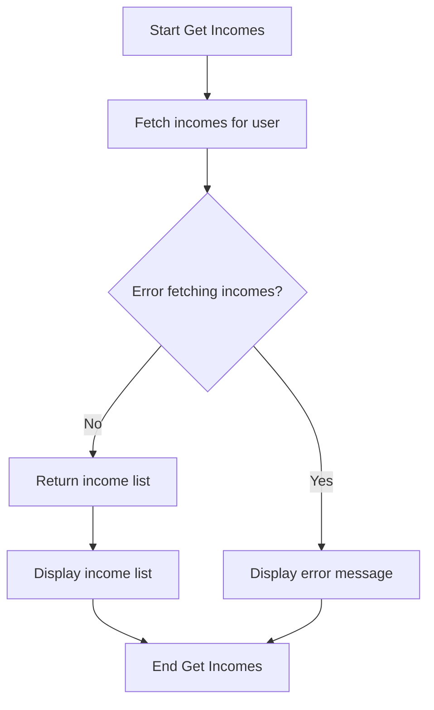
```mermaid
flowchart TD
    A[Start Get Incomes] --> B[Fetch incomes for user]
    B --> C{Error fetching incomes?}
    C -- Yes --> D[Display error message]
    C -- No --> E[Return income list]
    E --> F[Display income list]
    F --> G[End Get Incomes]
    D --> G
```

## Get Expenses Process

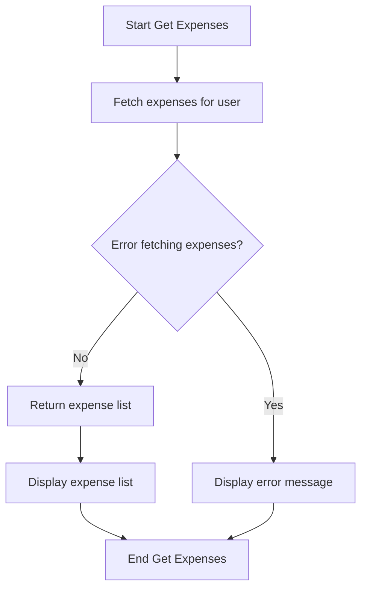
```mermaid
flowchart TD
    A[Start Get Expenses] --> B[Fetch expenses for user]
    B --> C{Error fetching expenses?}
    C -- Yes --> D[Display error message]
    C -- No --> E[Return expense list]
    E --> F[Display expense list]
    F --> G[End Get Expenses]
    D --> G
```

## Add Income Process

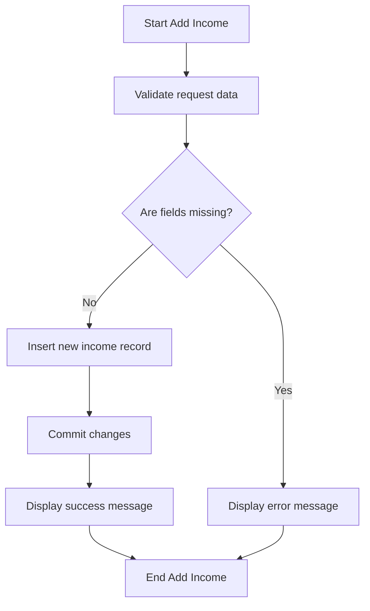
```mermaid
flowchart TD
    A[Start Add Income] --> B[Validate request data]
    B --> C{Are fields missing?}
    C -- Yes --> D[Display error message]
    C -- No --> E[Insert new income record]
    E --> F[Commit changes]
    F --> G[Display success message]
    G --> H[End Add Income]
    D --> H
```

## Add Expense Process

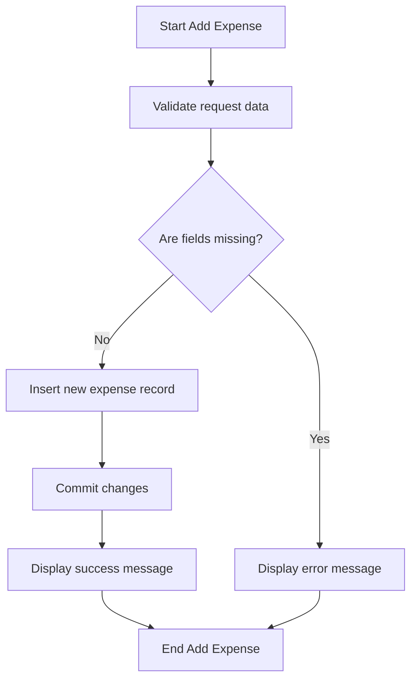
```mermaid
flowchart TD
    A[Start Add Expense] --> B[Validate request data]
    B --> C{Are fields missing?}
    C -- Yes --> D[Display error message]
    C -- No --> E[Insert new expense record]
    E --> F[Commit changes]
    F --> G[Display success message]
    G --> H[End Add Expense]
    D --> H
```

## Delete Income Process

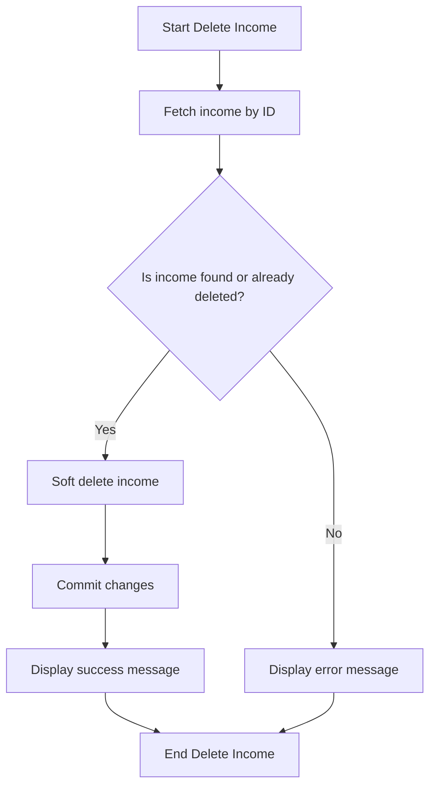
```mermaid
flowchart TD
    A[Start Delete Income] --> B[Fetch income by ID]
    B --> C{Is income found or already deleted?}
    C -- No --> D[Display error message]
    C -- Yes --> E[Soft delete income]
    E --> F[Commit changes]
    F --> G[Display success message]
    G --> H[End Delete Income]
    D --> H
```

## Delete Expense Process

```mermaid
flowchart TD
    A[Start Delete Expense] --> B[Fetch expense by ID]
    B --> C{Is expense found or already deleted?}
    C -- No --> D[Display error message]
    C -- Yes --> E[Soft delete expense]
    E --> F[Commit changes]
    F --> G[Display success message]
    G --> H[End Delete Expense]
    D --> H
```

## Update Income Process

```mermaid
flowchart TD
    A[Start Update Income] --> B[Fetch income by ID]
    B --> C{Is income found or already deleted?}
    C -- No --> D[Display error message]
    C -- Yes --> E[Update income details]
    E --> F[Commit changes]
    F --> G[Display success message]
    G --> H[End Update Income]
    D --> H
```

## Update Expense Process

```mermaid
flowchart TD
    A[Start Update Expense] --> B[Fetch expense by ID]
    B --> C{Is expense found or already deleted?}
    C -- No --> D[Display error message]
    C -- Yes --> E[Update expense details]
    E --> F[Commit changes]
    F --> G[Display success message]
    G --> H[End Update Expense]
    D --> H
```
