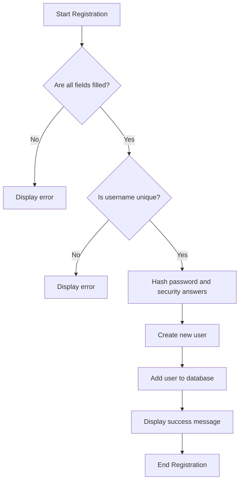
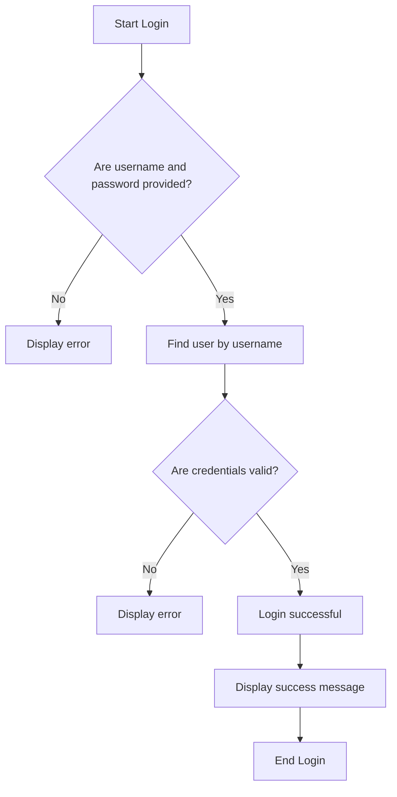
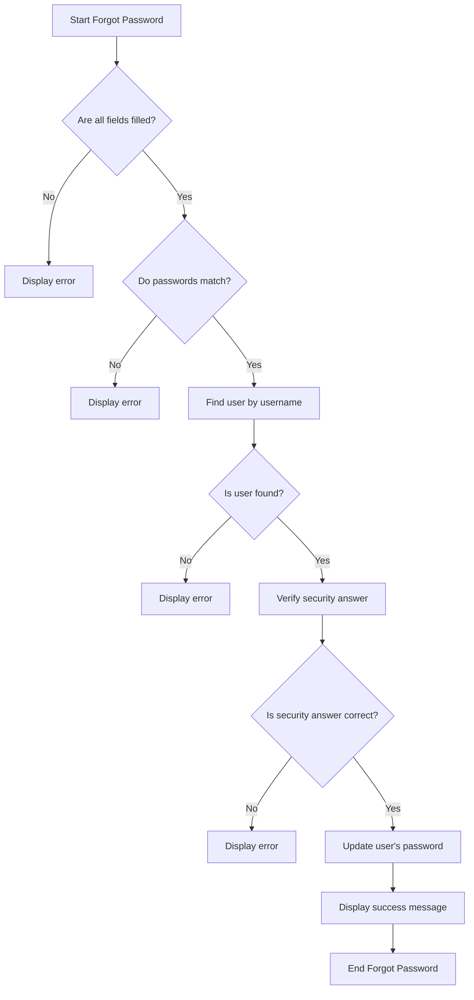
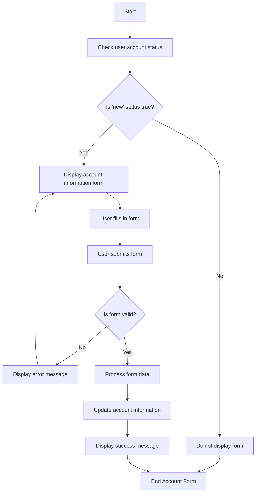
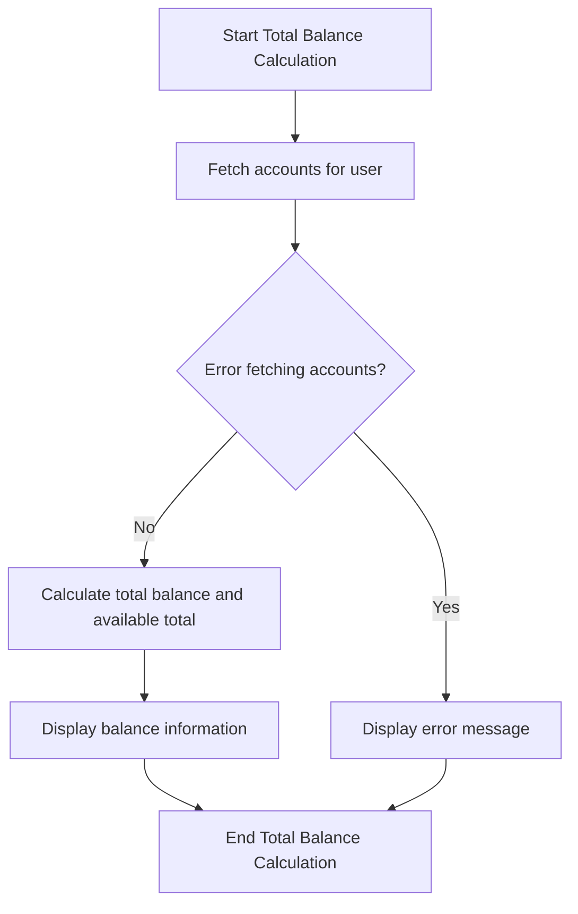
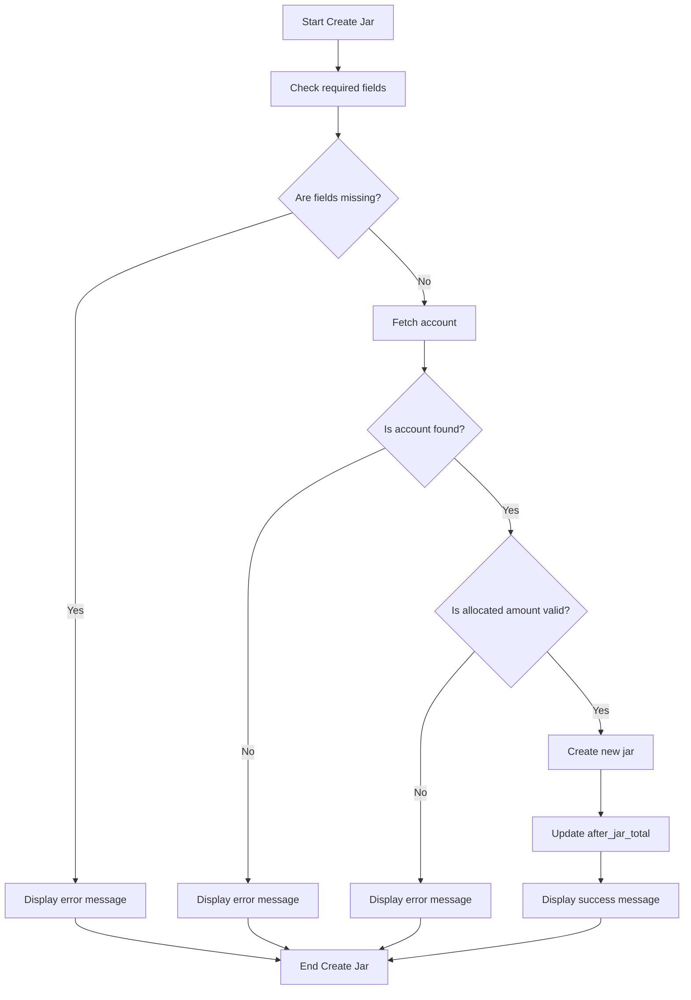
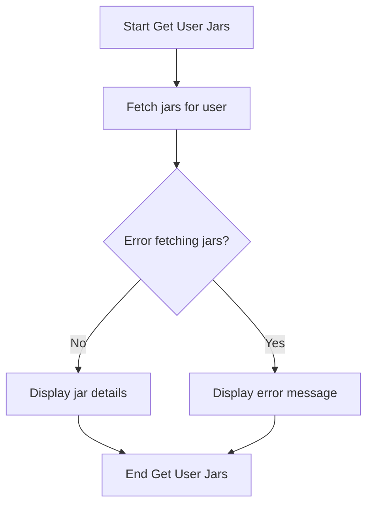
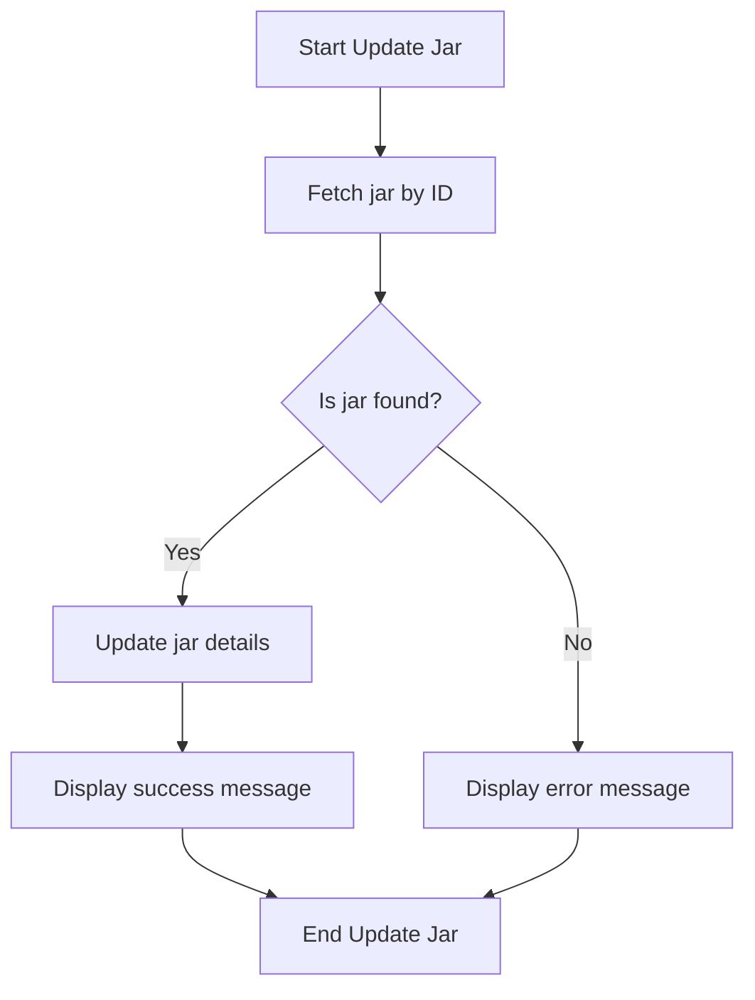
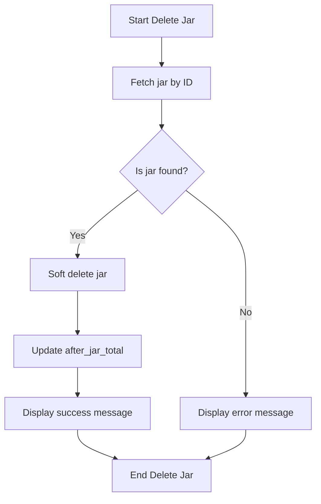

# Activity Diagrams

## User Registration Process

## User Login Process

## Forgot Password Process

## Account Information Form Process

## Total Balance Process

## Create Jar Process

## Get User Jars Process

## Update Jar Process

## Delete Jar Process

