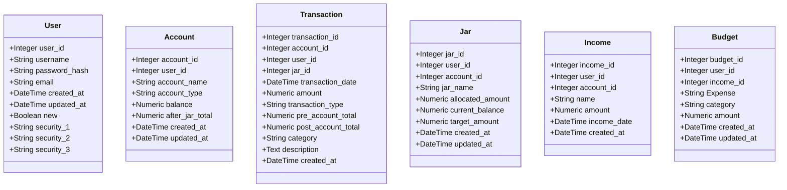

# Class Diagram
 

```mermaid
classDiagram
    class User {
        +Integer user_id
        +String username
        +String password_hash
        +String email
        +DateTime created_at
        +DateTime updated_at
        +Boolean new
        +String security_1
        +String security_2
        +String security_3
    }
    class Account {
        +Integer account_id
        +Integer user_id
        +String account_name
        +String account_type
        +Numeric balance
        +Numeric after_jar_total
        +DateTime created_at
        +DateTime updated_at
    }
    class Transaction {
        +Integer transaction_id
        +Integer account_id
        +Integer user_id
        +Integer jar_id
        +DateTime transaction_date
        +Numeric amount
        +String transaction_type
        +Numeric pre_account_total
        +Numeric post_account_total
        +String category
        +Text description
        +DateTime created_at
    }
    class Jar {
        +Integer jar_id
        +Integer user_id
        +Integer account_id
        +String jar_name
        +Numeric allocated_amount
        +Numeric current_balance
        +Numeric target_amount
        +DateTime created_at
        +DateTime updated_at
    }
    class Income {
        +Integer income_id
        +Integer user_id
        +Integer account_id
        +String name
        +Numeric amount
        +DateTime income_date
        +DateTime created_at
    }
    class Budget {
        +Integer budget_id
        +Integer user_id
        +Integer income_id
        +String Expense
        +String category
        +Numeric amount
        +DateTime created_at
        +DateTime updated_at
    }
```
