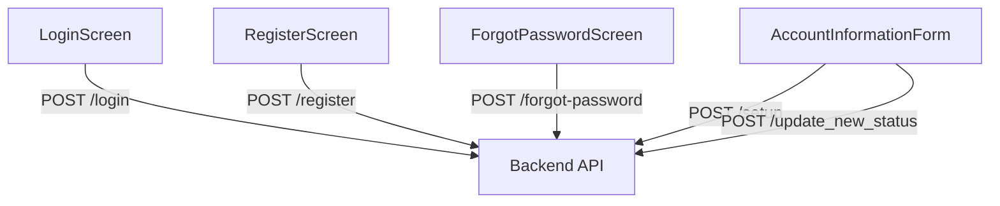

# Data Flow Diagram
 
## User Login Flow
 

```mermaid
graph TD
    LoginScreen[LoginScreen] -->|POST /login| BackendAPI[Backend API]
    RegisterScreen[RegisterScreen] -->|POST /register| BackendAPI
    ForgotPasswordScreen[ForgotPasswordScreen] -->|POST /forgot-password| BackendAPI
    AccountInformationForm[AccountInformationForm] -->|POST /setup| BackendAPI
    AccountInformationForm -->|POST /update_new_status| BackendAPI
```
## User Function Flow
