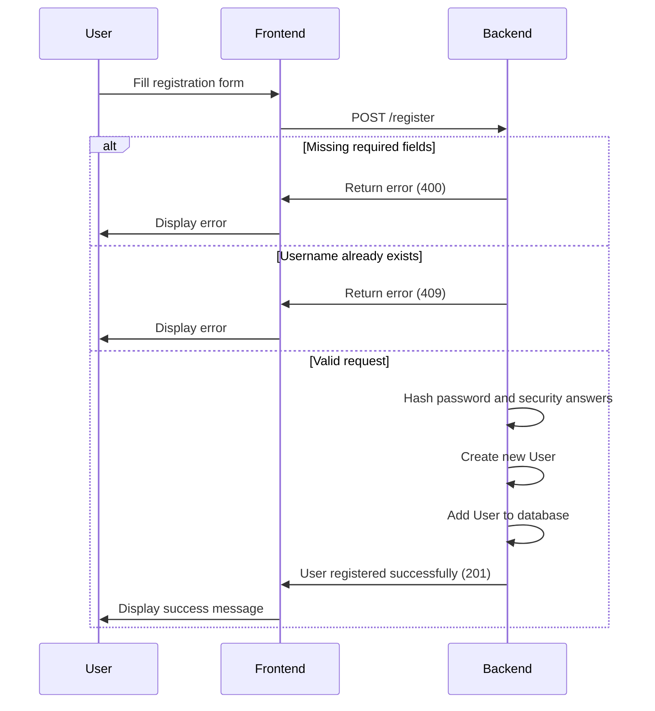
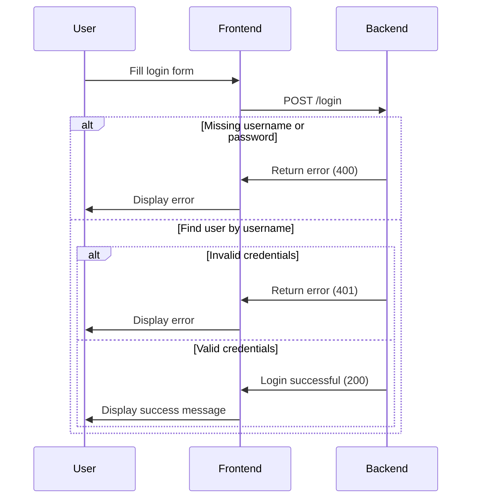
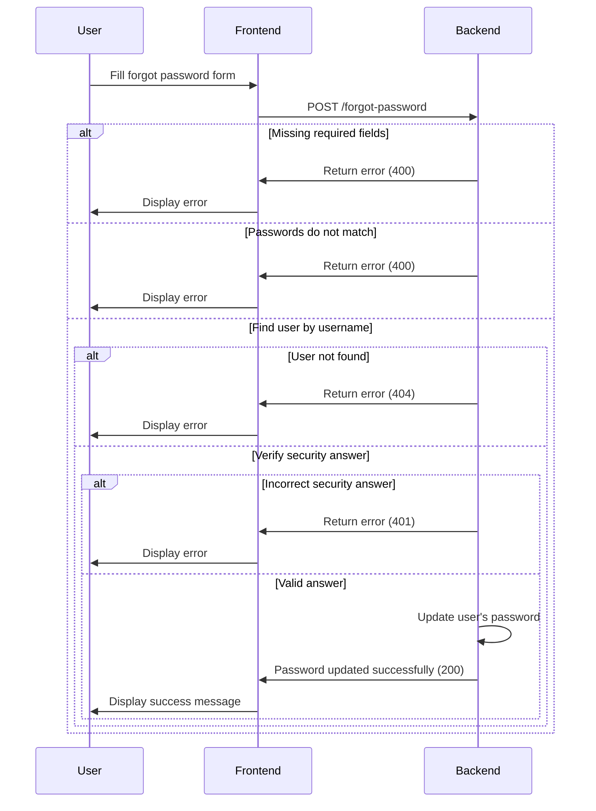
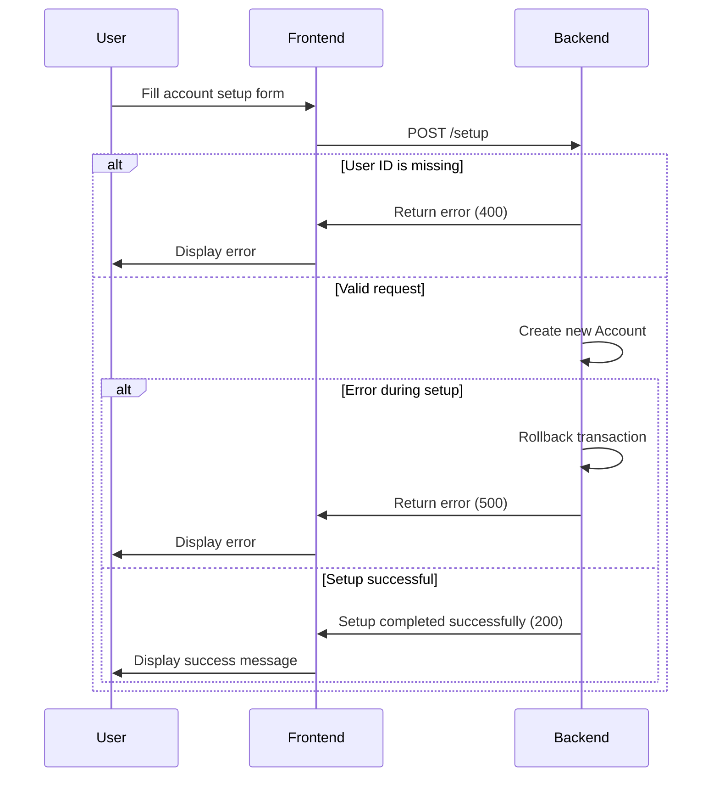
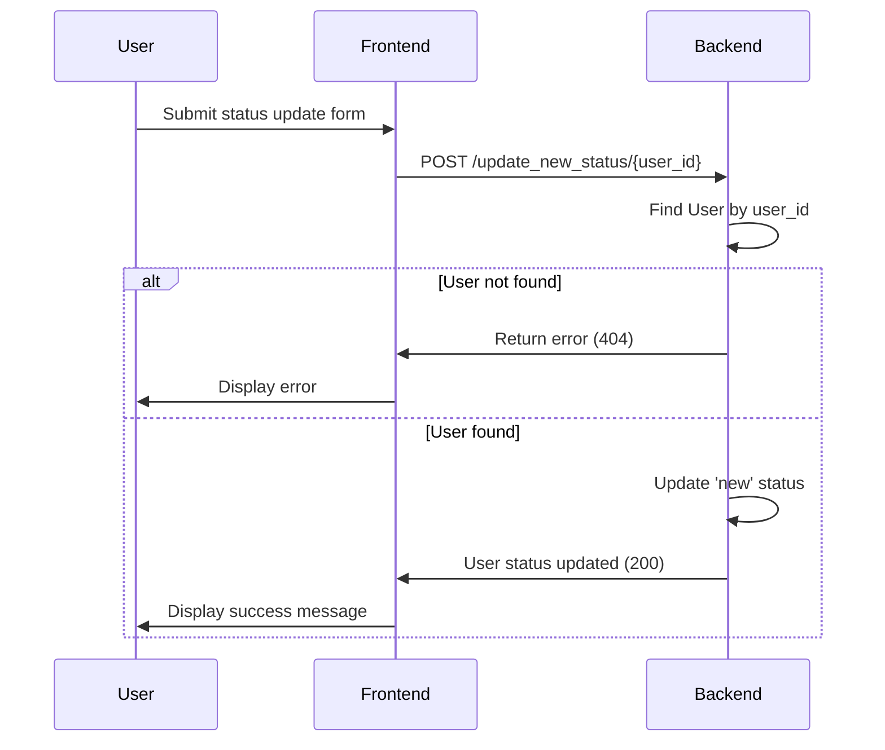

# Sequence Diagrams

## User Registration

```mermaid
sequenceDiagram
    participant User
    participant Frontend
    participant Backend
    User ->> Frontend: Fill registration form
    Frontend ->> Backend: POST /register
    alt Missing required fields
        Backend ->> Frontend: Return error (400)
        Frontend ->> User: Display error
    else Username already exists
        Backend ->> Frontend: Return error (409)
        Frontend ->> User: Display error
    else Valid request
        Backend ->> Backend: Hash password and security answers
        Backend ->> Backend: Create new User
        Backend ->> Backend: Add User to database
        Backend ->> Frontend: User registered successfully (201)
        Frontend ->> User: Display success message
    end
```

## User Registration

```mermaid
sequenceDiagram
    participant User
    participant Frontend
    participant Backend
    User ->> Frontend: Fill login form
    Frontend ->> Backend: POST /login
    alt Missing username or password
        Backend ->> Frontend: Return error (400)
        Frontend ->> User: Display error
    else Find user by username
        alt Invalid credentials
            Backend ->> Frontend: Return error (401)
            Frontend ->> User: Display error
        else Valid credentials
            Backend ->> Frontend: Login successful (200)
            Frontend ->> User: Display success message
        end
    end
```

## Forgot Password

```mermaid
sequenceDiagram
    participant User
    participant Frontend
    participant Backend
    User ->> Frontend: Fill forgot password form
    Frontend ->> Backend: POST /forgot-password
    alt Missing required fields
        Backend ->> Frontend: Return error (400)
        Frontend ->> User: Display error
    else Passwords do not match
        Backend ->> Frontend: Return error (400)
        Frontend ->> User: Display error
    else Find user by username
        alt User not found
            Backend ->> Frontend: Return error (404)
            Frontend ->> User: Display error
        else Verify security answer
            alt Incorrect security answer
                Backend ->> Frontend: Return error (401)
                Frontend ->> User: Display error
            else Valid answer
                Backend ->> Backend: Update user's password
                Backend ->> Frontend: Password updated successfully (200)
                Frontend ->> User: Display success message
            end
        end
    end
```

## Setup Account

```mermaid
sequenceDiagram
    participant User
    participant Frontend
    participant Backend
    User ->> Frontend: Fill account setup form
    Frontend ->> Backend: POST /setup
    alt User ID is missing
        Backend ->> Frontend: Return error (400)
        Frontend ->> User: Display error
    else Valid request
        Backend ->> Backend: Create new Account
        alt Error during setup
            Backend ->> Backend: Rollback transaction
            Backend ->> Frontend: Return error (500)
            Frontend ->> User: Display error
        else Setup successful
            Backend ->> Frontend: Setup completed successfully (200)
            Frontend ->> User: Display success message
        end
    end
```

## Update User 'New' Status

```mermaid
sequenceDiagram
    participant User
    participant Frontend
    participant Backend
    User ->> Frontend: Submit status update form
    Frontend ->> Backend: POST /update_new_status/{user_id}
    Backend ->> Backend: Find User by user_id
    alt User not found
        Backend ->> Frontend: Return error (404)
        Frontend ->> User: Display error
    else User found
        Backend ->> Backend: Update 'new' status
        Backend ->> Frontend: User status updated (200)
        Frontend ->> User: Display success message
    end
```
