# Sequence Diagrams

## User Registration

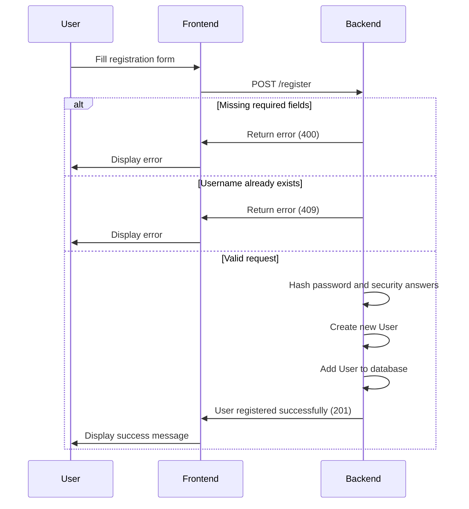

## User Login

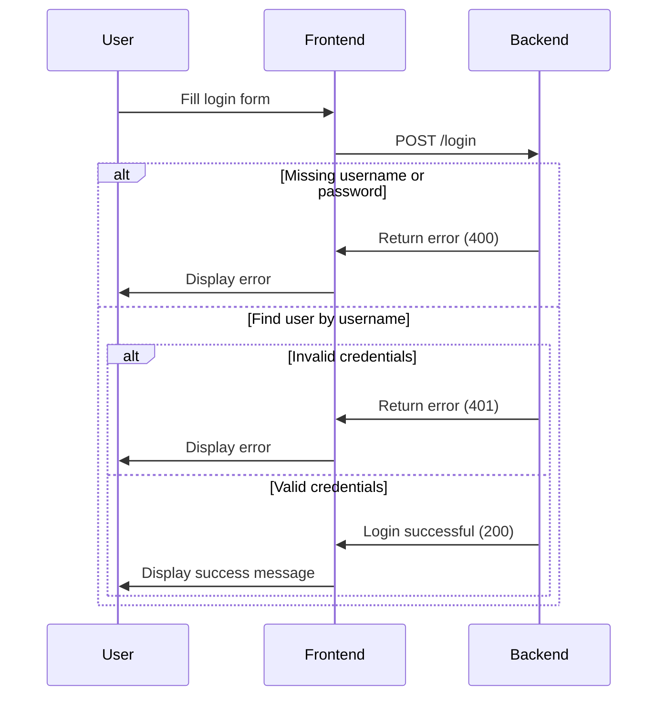

## Forgot Password

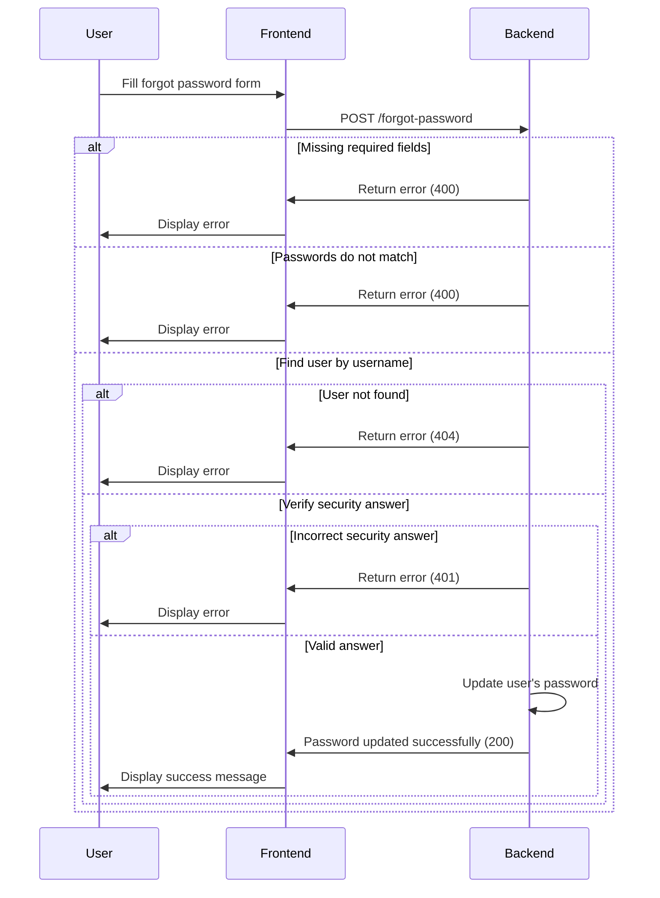

## Setup Account

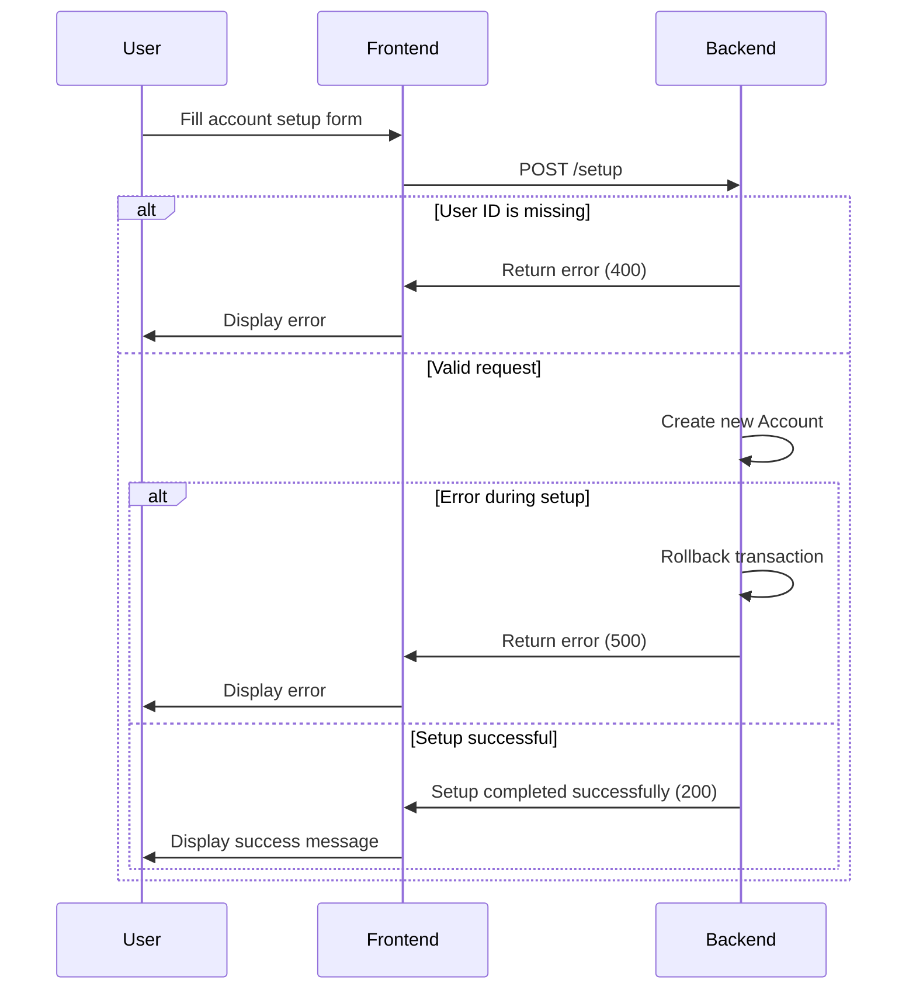

## Update User 'New' Status

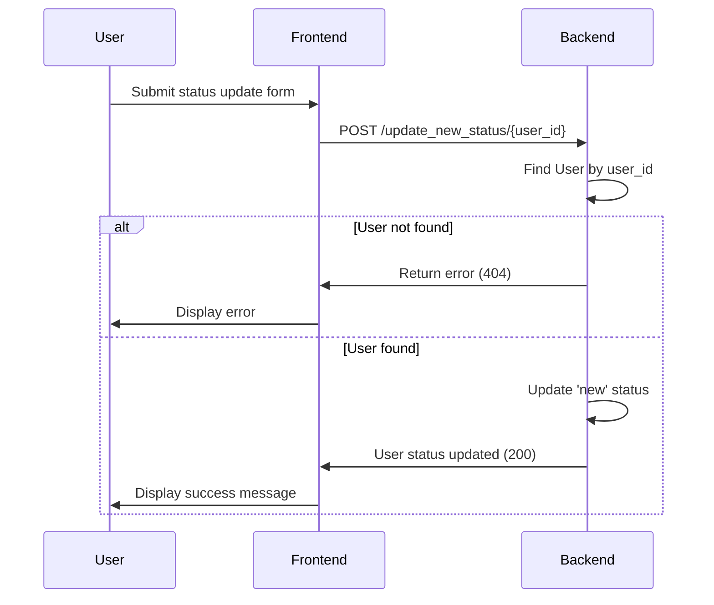

## Total Balance

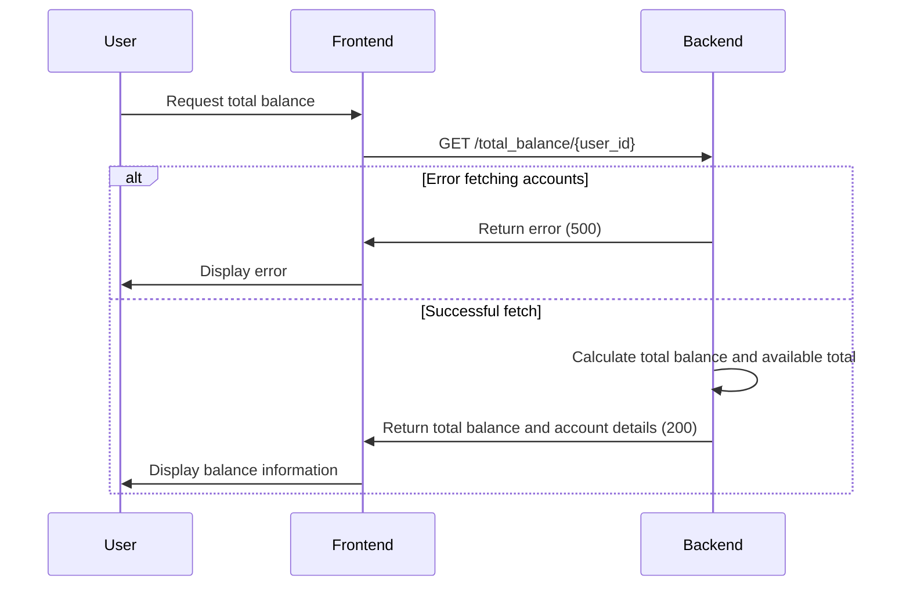

## Create Jar

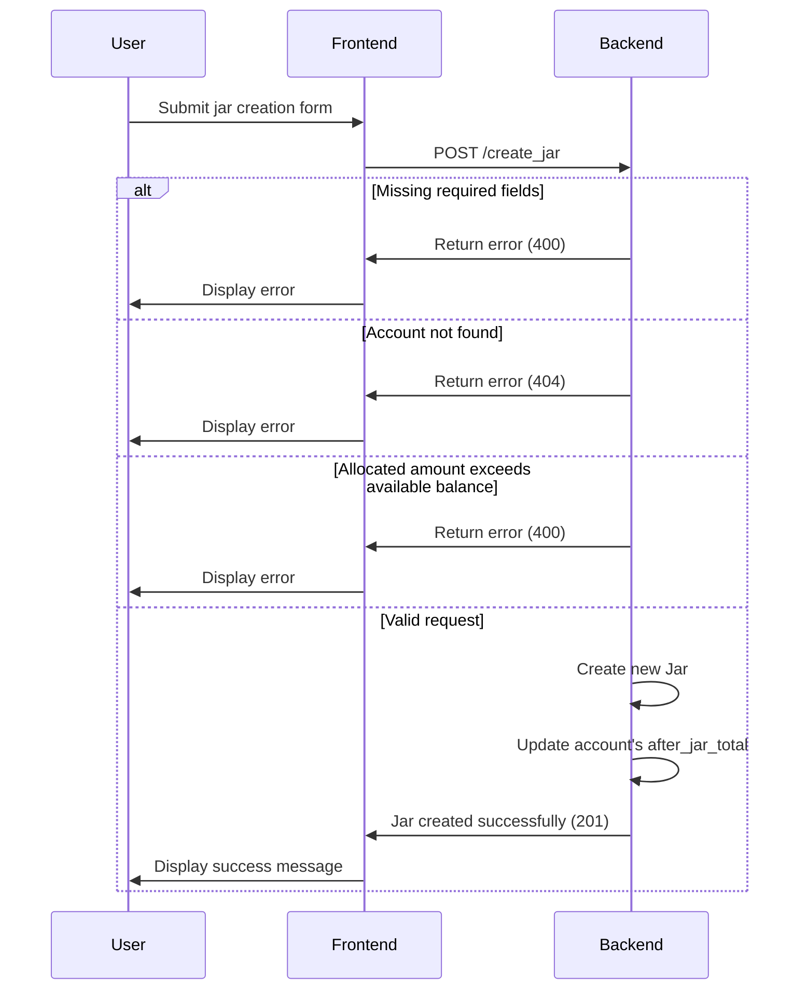

## Get User Jars

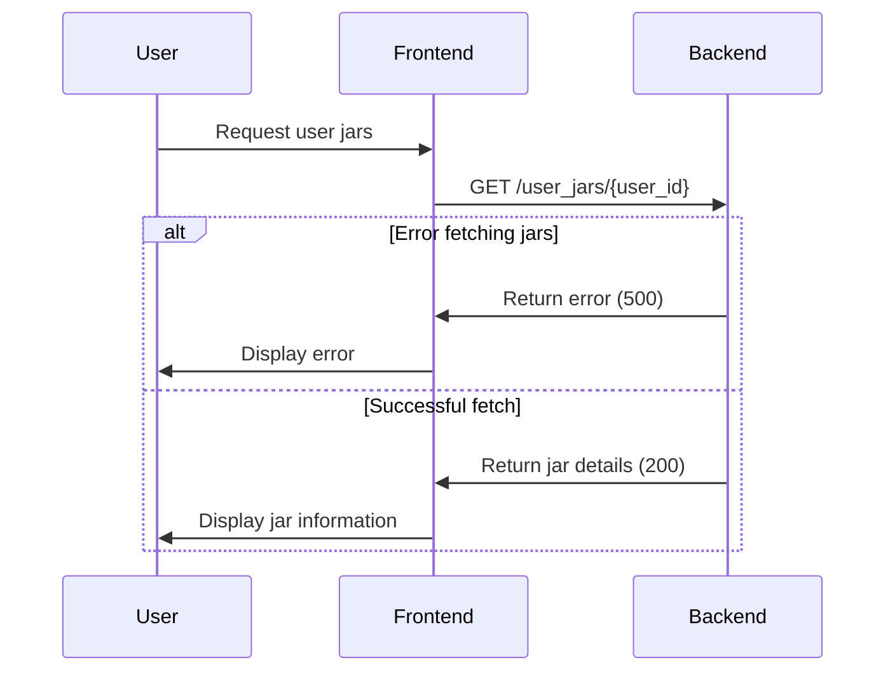

## Update Jar

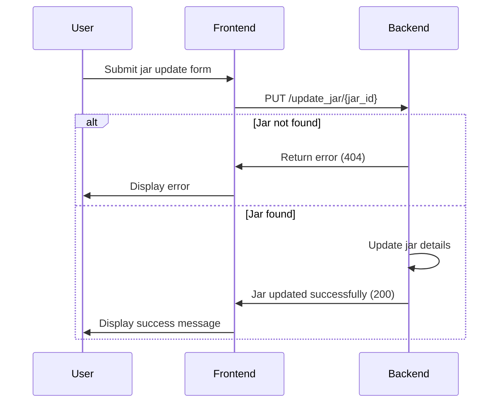

## Delete Jar

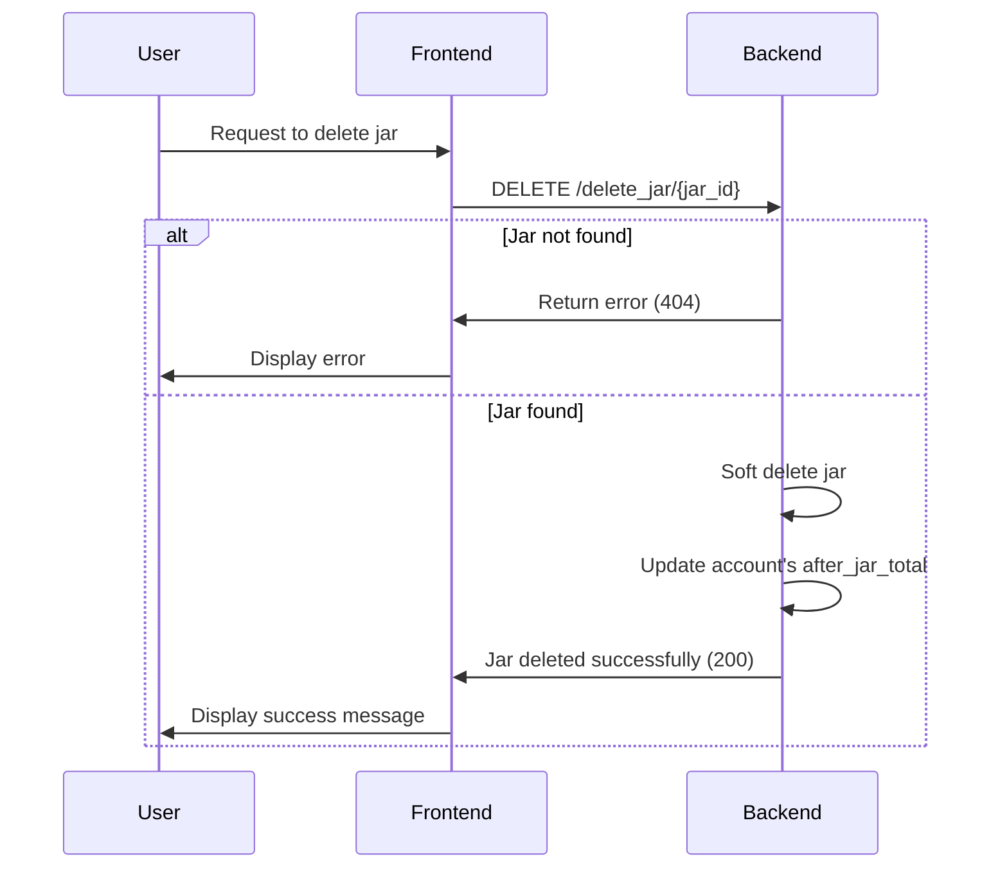

## Create Transaction Process

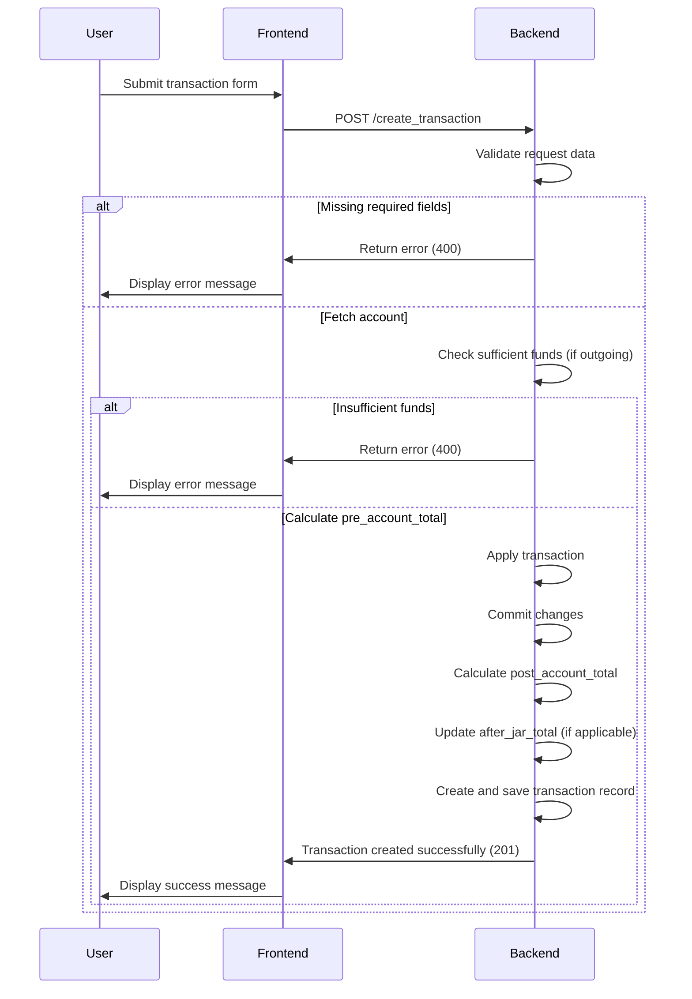

## Get User Transactions Process

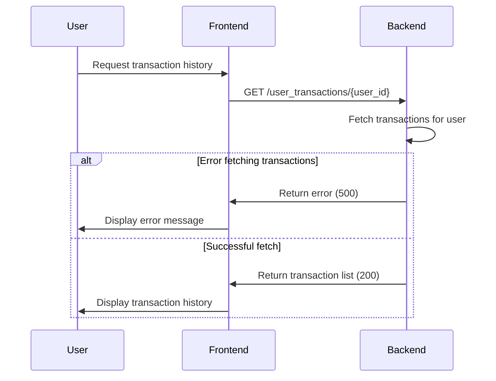

## Get User Jar Transactions Process

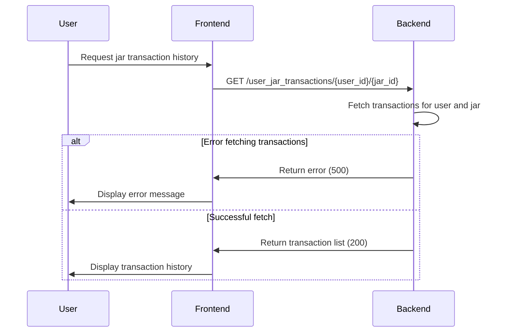
